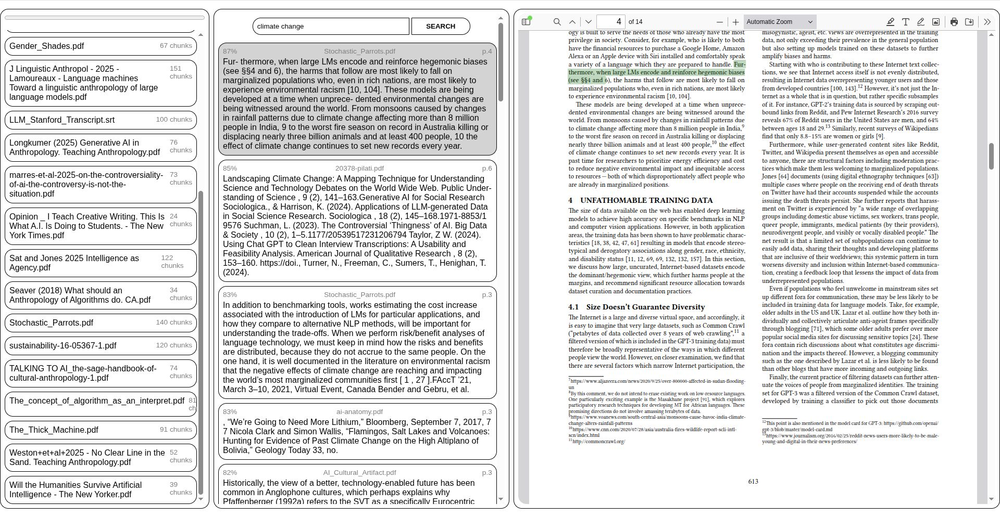
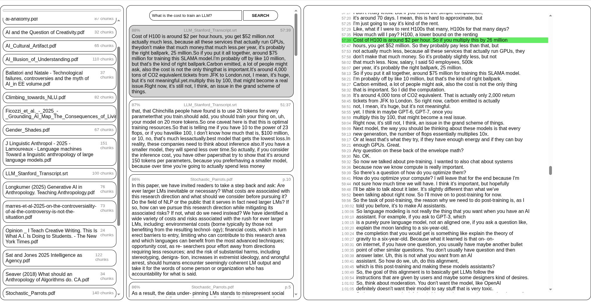

# RAJS
_Retrival Augmentation in JavaScript_

**Ask a question to get relevant references from your documents:**
[https://yertleturtlegit.github.io/rajs/](https://yertleturtlegit.github.io/rajs/)

Semantic search for documents (PDF, TXT) and transcription files (SRT) inside
your browser using pre-trained transformers. This tool runs locally and does not
upload your files to any server.

## Example Screenshots

### PDF

### SRT (transcription file format)
